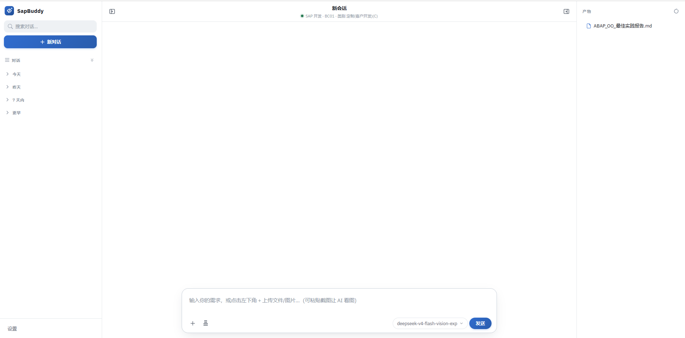
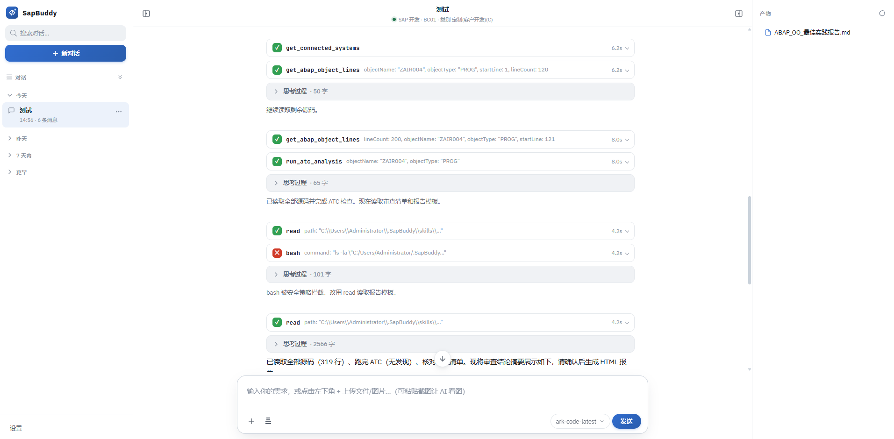
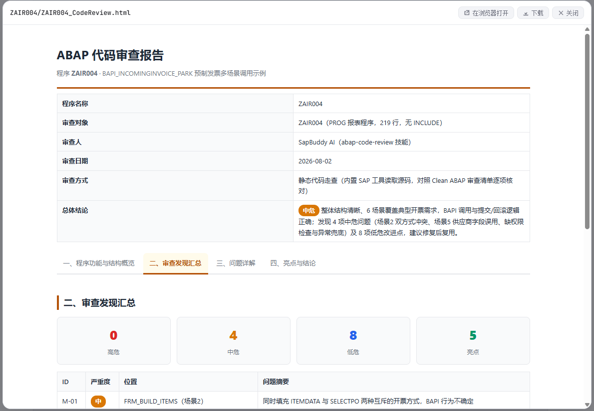
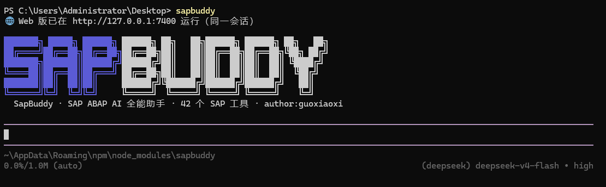

<p align="right"><strong>English</strong> | <a href="./README.md">简体中文</a></p>

<div align="center">

# 🛠 SapBuddy

**All-in-one AI assistant for SAP ABAP** — built for both development consultants and business consultants

Drive **41 SAP tools** with natural language: search, read code, develop, review, ATC, unit test, SQL, DDIC management, program explanation, and more.

[](https://www.npmjs.com/package/sapbuddy)
[](LICENSE)
[](https://github.com/gxx950224/sapbuddy/actions)
[](package.json)
[](CONTRIBUTING.md)

</div>

---

## ✨ Why SapBuddy?

| Scenario | Traditional way | SapBuddy |
|---|---|---|
| Understand a Z report's logic | Open SE38 → read line by line → look up tables and fields | 💬 "Explain what ZPPR006 does" |
| Develop a new report | Hand-write selection screen / ALV / query template | 💬 "Create report ZAIR007, reading XXX" |
| Code review | Manually check each line against the rules | 💬 "Review ZPPR085" → 4-tab HTML report |
| Query table data | Query manually in SE16N | 💬 "Query all client categories in T000" |
| DDIC changes | Build domain / data element / table step by step in SE11 | 💬 "Create data element + domain" (texts auto-filled) |

## 🎯 Key Features

- 💬 **Natural-language development**: query, analyze, develop, review and test SAP objects through conversation
- 🛠 **41 built-in SAP tools**: object search / source read / where-used / ATC quality gate / unit test / SQL query / transport request / version history / ST22 dump analysis / DDIC management (table / structure / data element / domain / CDS) / text elements & multilingual translation
- 🔒 **Three-layer security**: read-only by default + **development-client guard** (`T000.CCCATEGORY` auto-blocks writes on non-development clients) + fail-closed for production
- 🖥 **CLI + Web dual mode**: terminal interaction / browser UI (SSE streaming)
- 🔀 **Multiple models**: DeepSeek / OpenAI / Anthropic / Qwen and more (pi ecosystem)
- 🔌 **MCP compatible**: connect external MCP servers (e.g. the ZSX_MCP on the SAP side); auto-registered on both CLI and Web, tools usable immediately

## 📸 Screenshots

**Web chat UI** — the browser conversation page with streaming output; check SAP connection and model status at any time



**A real conversation result** — ask in plain language to read and analyze an SAP object, get the answer directly



**Code review report** — the reviewer generates a 4-tab HTML report (quality score / rule issues / ATC)



**CLI terminal** — full-screen interactive mode, talk directly in the terminal



## 🚀 Quick Start

### Option A: Install globally via npm (recommended)

```bash
npm install -g sapbuddy
sapbuddy doctor    # environment self-check
```

### Option B: Run from source

```bash
git clone https://github.com/gxx950224/sapbuddy.git
cd sapbuddy
npm install
npm run build
```

### First-time configuration (same for both options)

> All configuration lives under `~/.SapBuddy/` (a hidden directory in your home folder, fixed location — no matter where you run sapbuddy, it uses this one copy): auth.json / connections.json / settings.json / sessions / skills / prompts / output. The first run of `sapbuddy` auto-generates the config files and sample templates (template copies in `~/.SapBuddy/config/`), then fill them in as below.

```bash
# 1. AI model API key (required)
#    Open ~/.SapBuddy/auth.json and replace the sample text with your API key
#    (see ~/.SapBuddy/config/auth.example.json)

# 2. SAP connection (ADT requires /sap/bc/adt activated in SICF)
#    Open ~/.SapBuddy/connections.json and fill in system host / client / user
#    (see ~/.SapBuddy/config/connections.example.json)

# 3. (Optional) model and thinking level
#    Open ~/.SapBuddy/settings.json
#    (see ~/.SapBuddy/config/settings.example.json)
```

### Start talking

```bash
sapbuddy                           # interactive chat directly (full-screen TUI)
sapbuddy chat                      # interactive chat (same as above)
sapbuddy web                       # web version (http://127.0.0.1:7400)
sapbuddy "search classes starting with ZCL_*"   # one-off question
sapbuddy tools                     # list the 41 SAP tools + configured MCP tools
```

## 🧩 Architecture

```
User ──CLI / Web──► pi SDK (AgentSession)
                       │  41 SAP tools (direct function calls)
                       ▼
                  abap-adt-api ──ADT HTTPS──► SAP /sap/bc/adt
```

- **Direct integration**: the 41 tools are plain function modules registered directly as Agent customTools, no MCP framework required
- Tool registration happens at extension load time; MCP servers (optional) are registered dynamically through an async factory

## 📁 Project Structure

```
sapbuddy/
├── cli.mjs                 # CLI entry (chat / one-off / web / tools / doctor)
├── src/
│   ├── agent-core.mjs      # pi SDK session management + model parsing + runtime init
│   ├── sap-tools/          # 41 SAP tools (TypeScript, built on abap-adt-api)
│   └── web/                # local web server + UI + MCP client
├── defaults/               # default skills & models.json (shipped with the package, copied to ~/.SapBuddy/ on first run)
├── config/                 # config templates (no real credentials)
├── test/                   # smoke tests (node --test)
└── docs/                   # documentation
```

> Runtime config (`~/.SapBuddy/`: auth / connections / sessions / skills / outputs / MCP) is initialized automatically by the program, stored fixed in the home directory, and never distributed with the repo or npm package.

## 🔒 Security

- **Read-only by default**: `security.readOnly: true`, write operations require explicit enabling
- **Development-client guard (on by default)**: before a write, `T000.CCCATEGORY` is checked; only development-class clients (`C` customizing/customer development) may modify code; test (T) / production (P) / demo (D) / training (E) / SAP reference (S) are **always rejected**; fail-closed when it cannot be confirmed
- SAP passwords and API keys are never stored in the repo (templates desensitized, excluded via `.gitignore`)
- Write operations require the user to **review the change first** before execution (enforced by the Agent gate)

## 🧪 Tests

```bash
npm test        # smoke tests: tool loading / CLI / build output / config templates
npm run check   # TypeScript type check
```

Full regression matrix: [docs/TESTING.md](./docs/TESTING.md).

## ❓ FAQ

**Q: What SAP permissions are needed?**
Access to the ADT service (`/sap/bc/adt`) plus read/write authorization for the target objects; query tools need the corresponding authorization objects.

**Q: How do I bring my own model?**
Edit `~/.SapBuddy/auth.json` for the API key, add models in `~/.SapBuddy/models.json`; the settings page (Web) lets you switch directly.

**Q: How do I use MCP tools?**
Settings → MCP: add a server (streamable-http, SSE responses compatible), it auto-connects on save and registers tools as `mcp_<server>_<toolname>`, usable on both CLI and Web. The server name comes from the key in mcp.json; reference it in lowercase-with-underscores form (e.g. `mcp_sap-mcp-dev_GET_TCODE_INFO`).

**Q: Why are write operations rejected on a test system?**
The development-client guard is blocking them — this is by design. Only development-class clients (default `C`) can write, see [Security](#-security).

## 🗺 Roadmap

- [x] 41 SAP tools (search / read / write / ATC / unit test / SQL / DDIC / text / translation)
- [x] CLI + Web dual mode
- [x] Development-client guard + pre-write review gate
- [x] MCP server support
- [ ] Batch code-review reports (multiple objects)
- [ ] Custom tool scripts (SAP-side JS plugins)
- [ ] Team collaboration (shared skills / rule packages)

## 🤝 Contributing

PRs welcome! See [CONTRIBUTING.md](./CONTRIBUTING.md). Code style: no semicolons, double quotes, strict TS.

## 🙏 Credits

Agent sessions/models/tool framework are built on [pi-coding-agent](https://github.com/badlogic/pi-mono) (`@earendil-works/pi-coding-agent`);
SAP tool design and ADT interaction reference [marcellourbani/vscode_abap_remote_fs](https://github.com/marcellourbani/vscode_abap_remote_fs) and its LM Tools, implemented on top of [abap-adt-api](https://github.com/marcellourbani/abap-adt-api). See [CREDITS.md](./CREDITS.md).

## 📄 License

[MIT](./LICENSE)
